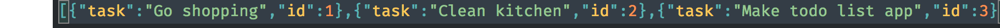

# Todo List App in Node.js

**Description**

A Todo list app made in node.js.

We can add, read, remove and list tasks using the command line.

Behind the scenes a file is created and a JSON string of tasks is added into it.

# How to use

## Installation

- **requirements**: node and npm installed in your computer

1. Download
2. Open your comand line interface
3. `cd` into the folder
4. Write `npm install`

---

## Commands and Options

**Add --name(-n)**

`node app.js add -n <name of the task>`

**list**

`node app.js list`

**edit --task(-t)**

`node app.js edit -t <task number>`

**remove --task(-t)**

`node app.js remove -t <task number>`

## Other Options

**--help, -h**

`node app.js --help`
